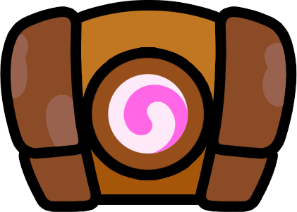
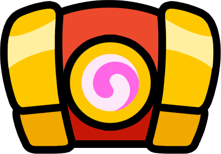
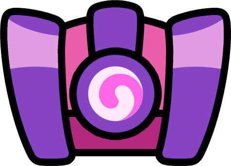

# 宝箱循环

与《皇室战争》类似，你通过战斗赢得的宝箱的稀有度并不是随机的。它们由一个循环预先定义，对于每个玩家都是一致的，从而确保所有玩家的进展平衡和一致。

## 概述

宝箱循环的长度为60个宝箱，稀有度的分布如下：

- 36个普通宝箱（60%）
- 18个稀有宝箱（30%）
- 6个史诗宝箱（10%）

一旦你达到序列的末尾，循环将重新回到开始。

## 循环

| Index | Icon | Rarity | 
| -- | -- | -- |
| 1 |  | Common |
| 2 |  | Rare |
| 3 |  | Common |
| 4 |  | Common |
| 5 |  | Rare |
| 6 |  | Common |
| 7 |  | Common |
| 8 |  | Rare |
| 9 |  | Common |
| 10 |  | Rare |
| 11 |  | Rare |
| 12 |  | Common |
| 13 |  | Epic |
| 14 |  | Common |
| 15 |  | Rare |
| 16 |  | Common |
| 17 |  | Common |
| 18 |  | Common |
| 19 |  | Rare |
| 20 |  | Common |
| 21 |  | Epic |
| 22 |  | Common |
| 23 |  | Common |
| 24 |  | Rare |
| 25 |  | Common |
| 26 |  | Rare |
| 27 |  | Common |
| 28 |  | Common |
| 29 |  | Rare |
| 30 |  | Rare |
| 31 |  | Common |
| 32 |  | Common |
| 33 |  | Common |
| 34 |  | Epic |
| 35 |  | Common |
| 36 |  | Epic |
| 37 |  | Rare |
| 38 |  | Common |
| 39 |  | Common |
| 40 |  | Rare |
| 41 |  | Common |
| 42 |  | Common |
| 43 |  | Common |
| 44 |  | Rare |
| 45 |  | Common |
| 46 |  | Rare |
| 47 |  | Common |
| 48 |  | Common |
| 49 |  | Common |
| 50 |  | Rare |
| 51 |  | Common |
| 52 |  | Epic |
| 53 |  | Common |
| 54 |  | Common |
| 55 |  | Common |
| 56 |  | Common |
| 57 |  | Rare |
| 58 |  | Common |
| 59 |  | Epic |
| 60 |  | Rare |

## 查找你的循环

知道你下一个宝箱的稀有度并不会带来很大的区别，但如果你知道下一个宝箱将是史诗宝箱，那么在游戏中尽可能发挥得更好会有所帮助……或者为连续出现的稀有宝箱做好准备！

为了做到这一点，你需要注意一些不寻常的宝箱序列。其中主要的是史诗宝箱和连续出现的稀有宝箱。如果你追踪这些宝箱之后的3个宝箱，你就能确定你在循环中的位置。