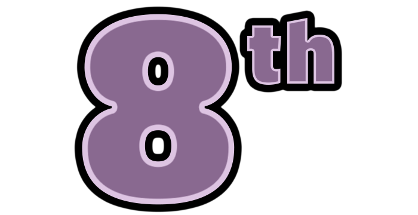
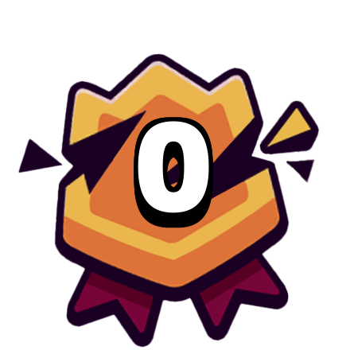
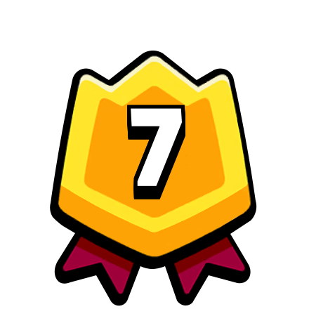
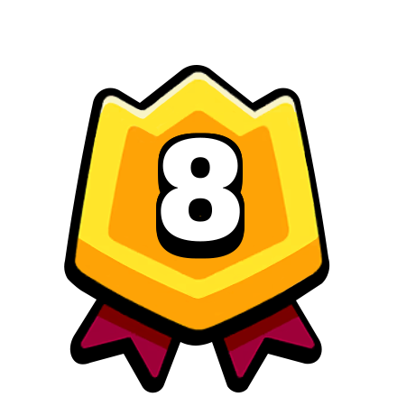
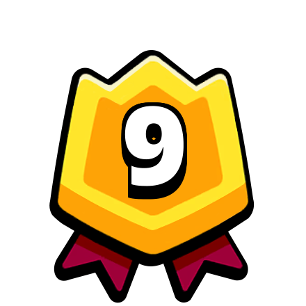
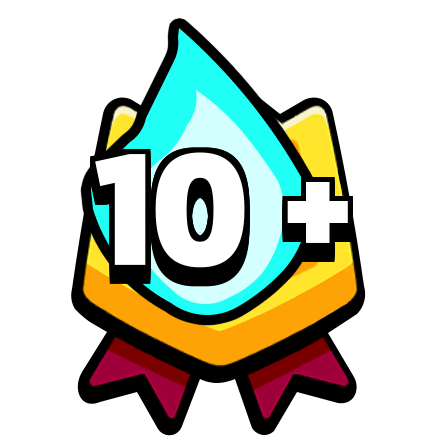

# 宝箱大小

完成战斗后获得的宝箱被称为“奖励宝箱”。这些宝箱的大小（部队数量）可以根据您获得的点击数而有所不同。

这些宝箱的稀有度由宝箱周期预定义，您可以在[这里](/sb/chest_cycle)找到更多信息。
<!---
  -->

每个宝箱的点击数范围为2至7：
- 2是最少的，用于完成第9或第10名。
- 7是最多的，用于在前三名中并保持最大连胜。

每个宝箱的最小部队数量为1，但每次点击都有机会使其变大。

解锁新部队的宝箱没有大小增加，这意味着您只会看到稀有度的变化，最后您将获得一个新的部队。

获得点击的两种方式如下：

[[toc]]

## 战斗排名

根据您的战斗排名，您可以获得2至4个点击：

| | Placement | Bonus Taps | 
| -- | -- | -- |
|  | First | 4 Taps |
|  | Second | 4 Taps |
|  | Third | 4 Taps |
|  | Fourth | 3 Taps |
|  | Fifth | 3 Taps |
|  | Sixth | 3 Taps |
|  | Seventh | 3 Taps |
|  | Eighth | 3 Taps |
|  | Ninth | 2 Taps |
|  | Tenth | 2 Taps |

## Top 5 Streak

| | Streak Size | Bonus Taps | 
| -- | -- | -- |
|  | 0 wins | 0 Taps |
|  | 1 win | 0 Taps |
|  | 2 wins | 1 Tap |
|  | 3 wins | 1 Tap |
|  | 4 wins | 1 Tap |
|  | 5 wins | 2 Taps |
|  | 6 wins | 2 Taps |
|  | 7 wins | 2 Taps |
|  | 8 wins | 2 Taps |
|  | 9 wins | 2 Taps |
|  | 10 wins or more | 3 Taps |

# 是否需要付费来保持你的连胜记录？

通常情况下，不需要，但这主要取决于你想要优先考虑的内容。保持连胜记录的价格取决于你的连胜次数；你可以在[这里](/sb/keep_streak_prices)找到所有这些价格的列表。

你想尽快解锁大宝箱吗？如果是的话，保持连胜记录将为你节省恢复连胜可能需要的30分钟时间。

你想尽可能高效地使用金币吗？在这种情况下，放弃连胜记录并尝试开始新的连胜。在你有一个良好的连胜记录时，把金币花在更多的宝箱上。

有一种情况下付费保持连胜是最优的，那就是当你**排队中有多个宝箱**而你即将失去一个中等连胜记录时。例如：

- 你有4到10次胜利
- 这是你一天中的第一个宝箱，但是你还有2个宝箱在排队中

如果发生这种情况，并且你认为你可以在剩下的宝箱中保持连胜，与购买更多宝箱相比，它将提供类似的价值。

<!---
如果你正在追踪你的[宝箱周期](/sb/chest_cycle)，在**你知道你将获得一张史诗宝箱**时，付费额外点击也可能是值得的。
  -->

# 策略：保持准备好的连胜记录！

为了优化你的进展，你应该避免在没有连胜记录的情况下打开宝箱。

实现这一点的一个好方法是始终保持你的连胜记录准备好，以便你想继续游戏时随时可以使用。根据你的排名是否一致，你可能更喜欢以下选项之一：

- **简单**：只需获得前5名！每当你为了一张宝箱继续游戏时，你就可以获得前5名并从连胜2次的奖励中获益。

- **中等**：获得连胜4次。与简单的方法类似，你的下一场战斗可以开始连胜5次，从而获得额外的奖励。

- **困难**：获得连胜9次。如果你想在下一个宝箱中获得最大的连胜奖励，这将是最佳选择。