# 爆裂小队怪物

在通往胜利的道路上，除了其他玩家的小队，你还必须与非玩家角色（NPC）和Boss战斗，以获取宝石和其他资源。

NPC敌人主要分为4个类别：

[[toc]]

大多数这些NPC也是你必须击败的怪物，以完成《成就簿》中的怪物任务。以下是按照生命值排序的所有怪物列表。

> [!NOTE]
> 许多怪物具有不同类型的攻击序列，因此无法将所有内容简化为单一的伤害值。每个怪物类别的表格显示了怪物的基础DPS，但许多怪物在使用超级攻击或其他能力时可能更加危险。

## [小型怪物](/sb/monsters_small)

    

        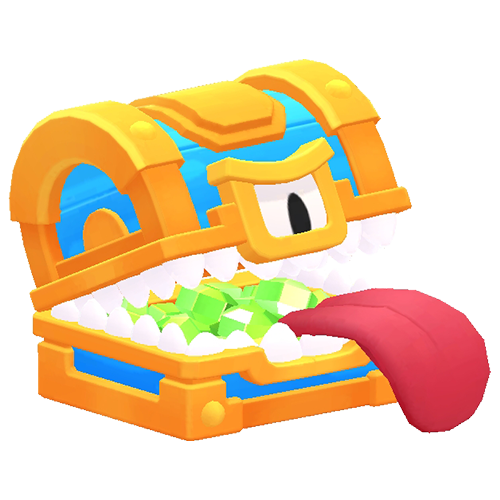
    

    

        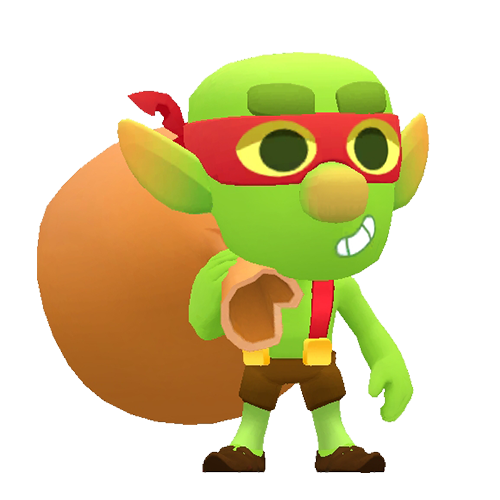
    

    

        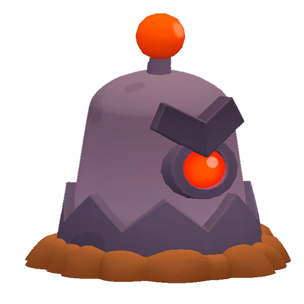
    

    

        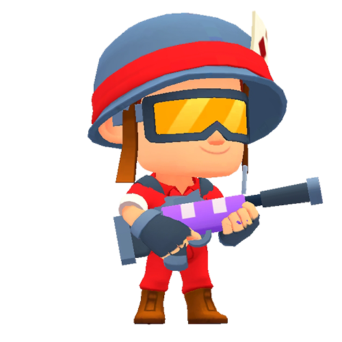
    

    

        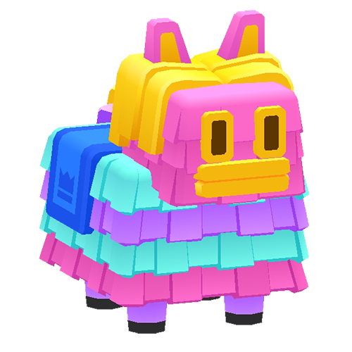
    

    

        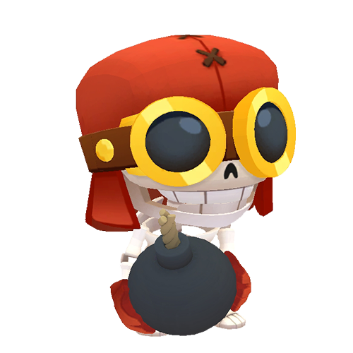
    

    

        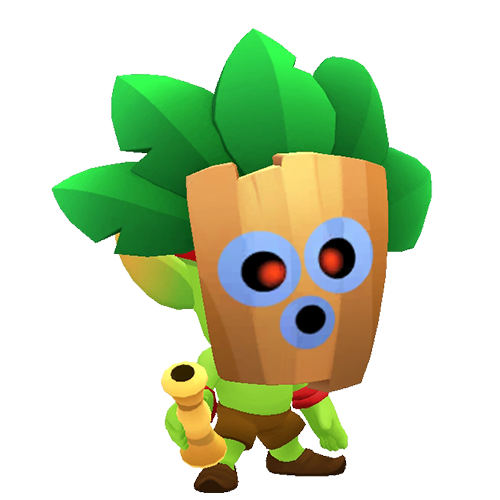
    

    

        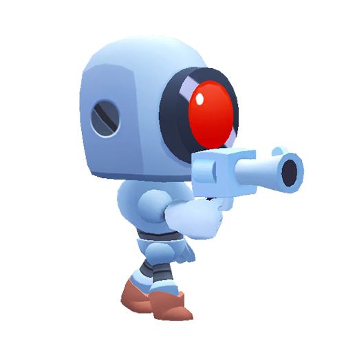
    

    

        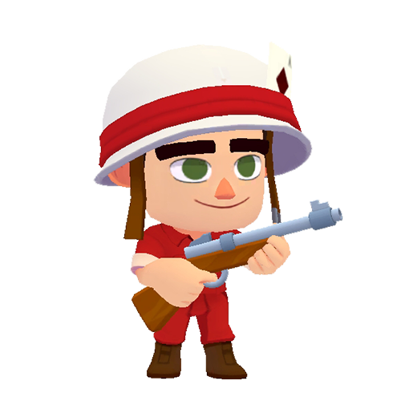
    

    

        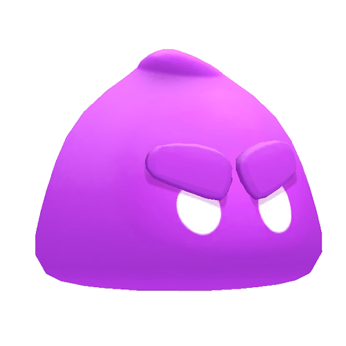
    

    

        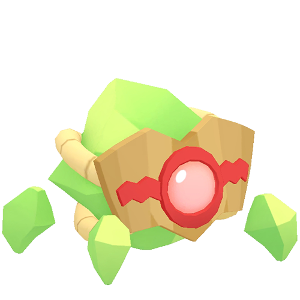
    

    

        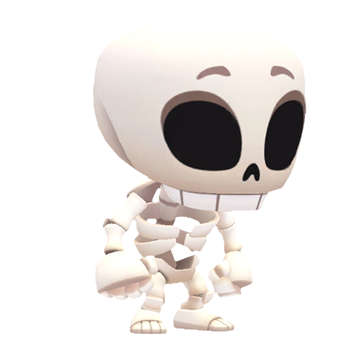
    

    

        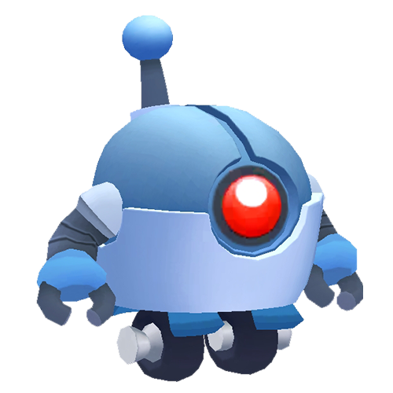
    

    

        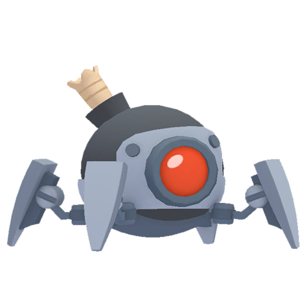
    

    

        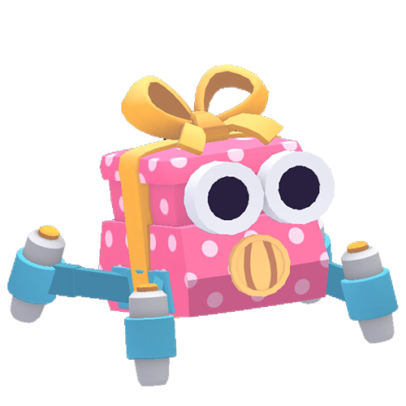
    

    

        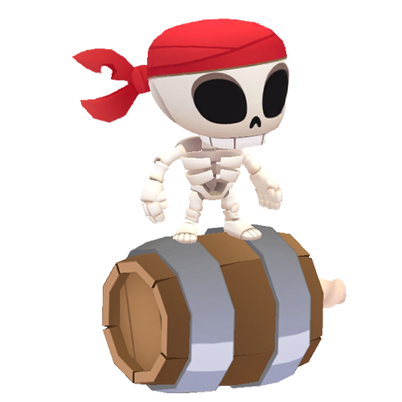
    

## [中型怪物](/sb/monsters_medium)

    

        
    

    

        
    

    

        
    

    

        
    

    

        
    

    

        
    

## [大型怪物](/sb/monsters_big)

    

        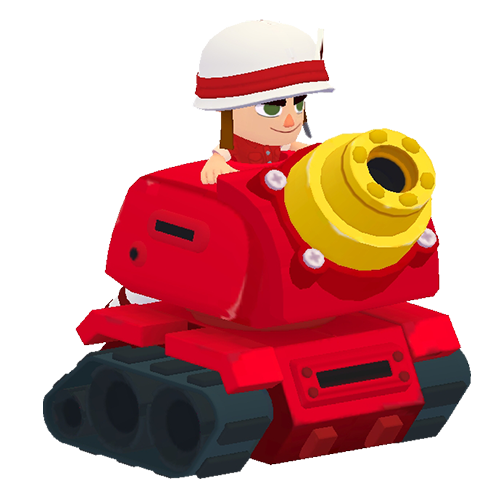
    

    

        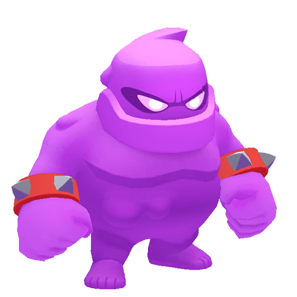
    

    

        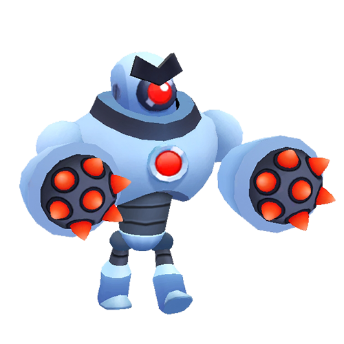
    

    

        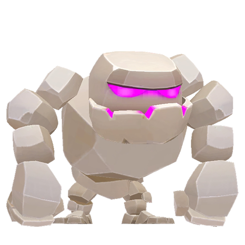
    

    

        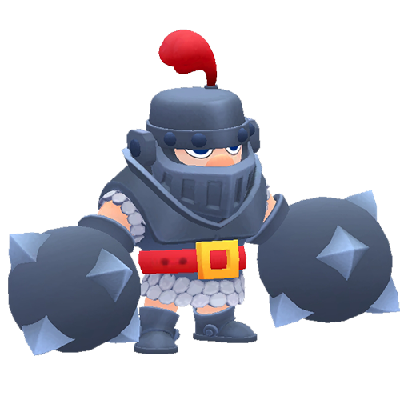
    

    

        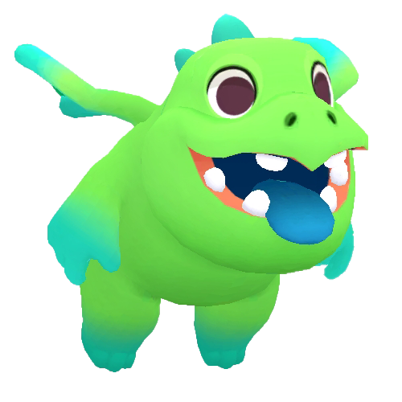
    

    

        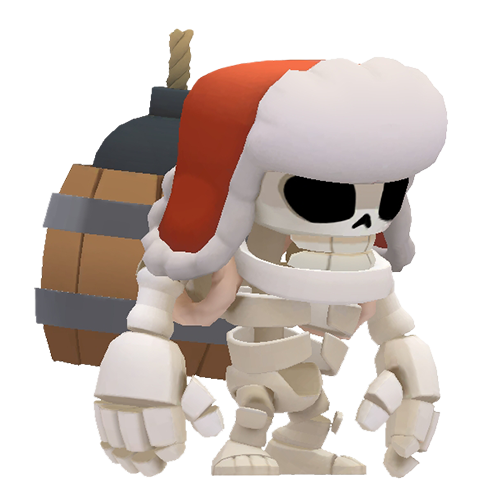
    

    

        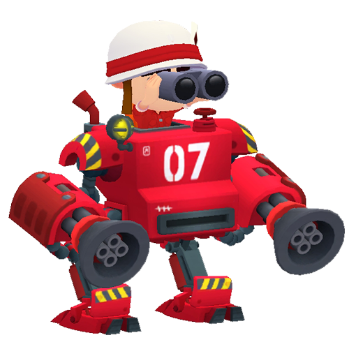
    

    

        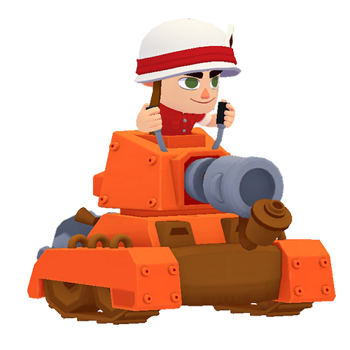
    

## [Bosses](/sb/monsters_bosses)

    

        
    

    

        
    

    

        
    

    

        
    

