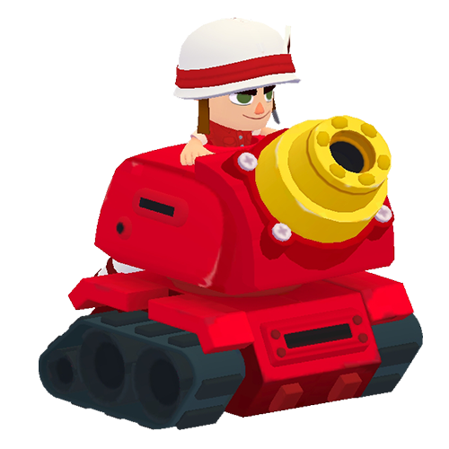
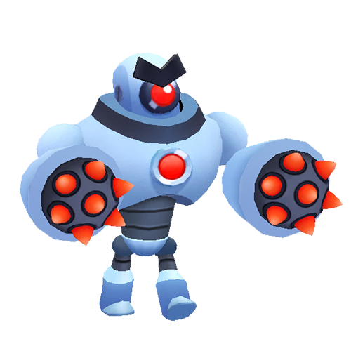
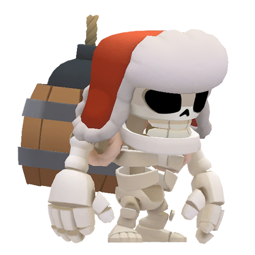
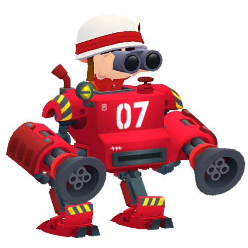

# 按生命值排序的大型怪物

|   | 怪物 | 生命值 | 基础DPS | 
| -- | -- | -- | -- |
|  | 弹雨战车 | 8000 | 20 |
|  | 圣水戈仑 | 7500 | 25 |
|  | 机器人首领 | 6000 | 25 |
|  | 戈仑石人 | 6000 | 50 |
|  | 超级骑士 | 6000 | 35 |
|  | 龙宝宝 | 5000 | 76 |
|  | 大骷髅 | 5000 | 80 |
|  | 机甲 | 5000 | 80 |
|  | 烈焰战车 | 5000 | 50 |

