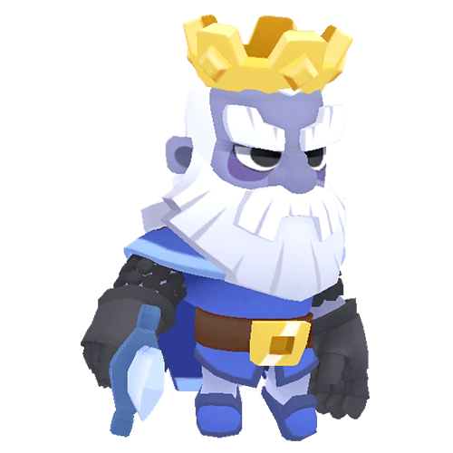
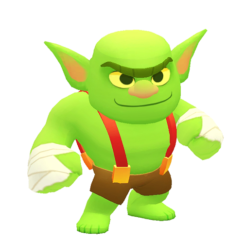
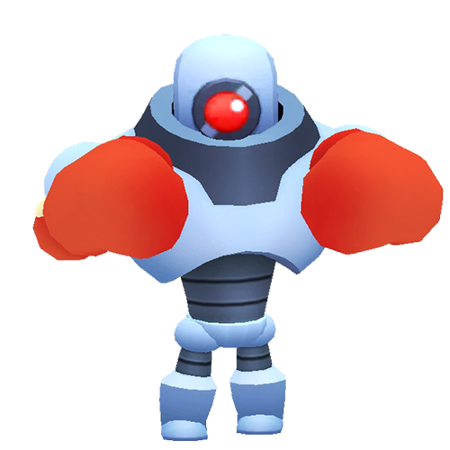
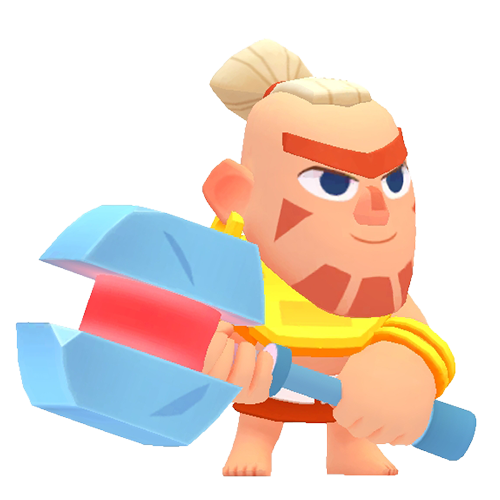
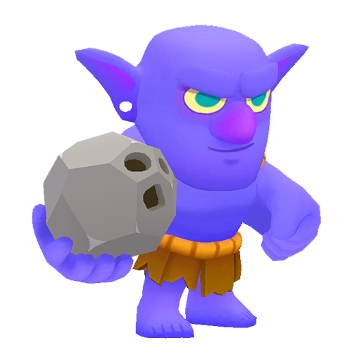
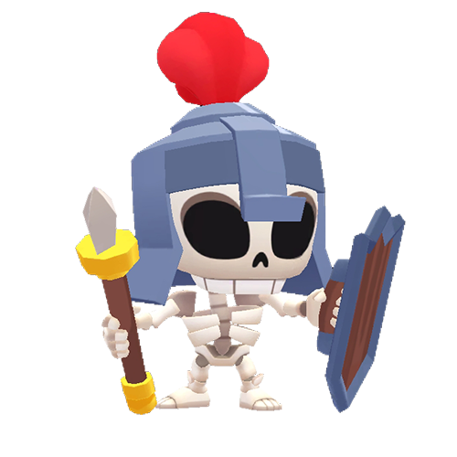

# 按生命值排序的中型怪物

|   | 怪物 | 生命值 | 基础DPS | 
| -- | -- | -- | -- |
|  | 皇家幽灵 | 3500 | 100 |
|  | 越狱哥布林 | 1500 | 70 |
|  | 拳击机器人 | 1500 | 70 |
|  | 土著勇士 | 1500 | 55 |
|  | 巨石投手 | 1200 | 23 |
|  | 骷髅守卫 | 600 | 30 |

