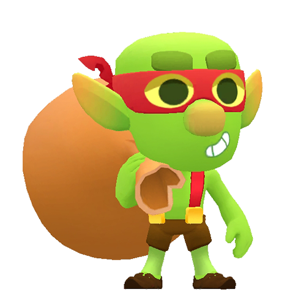
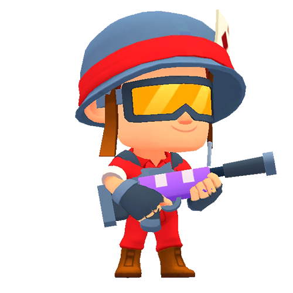
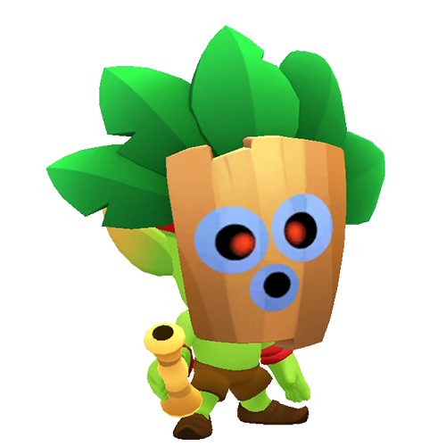
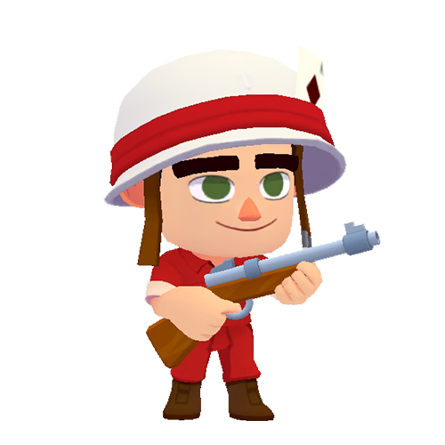
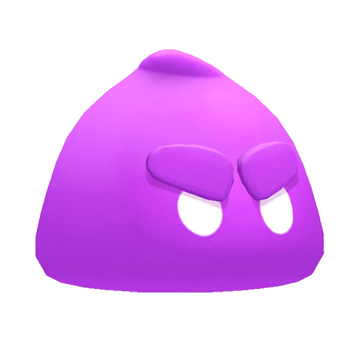
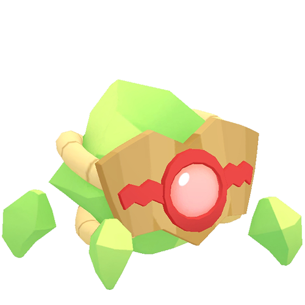
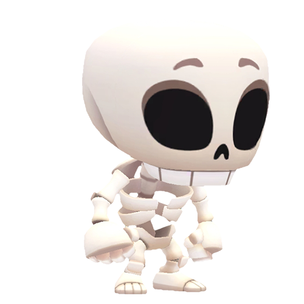
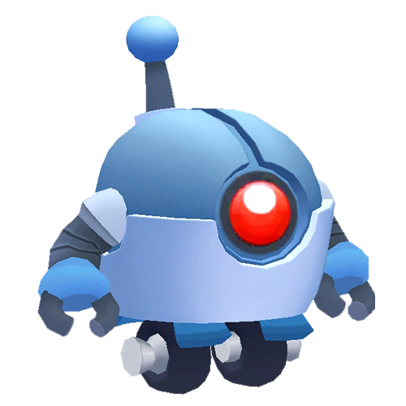

# Small Monsters Sorted By HP

|   | Monster | HP | Base DPS | 
| -- | -- | -- | -- |
|  | 史诗冒牌宝箱 | 3500 | 65 |
|  | 稀有冒牌宝箱 | 2250 | 80 |
|  | 战利品哥布林 | 1500 | - |
|  | 普通冒牌宝箱 | 1000 | 50 |
|  | 迷你鼹鼠 | 1000 | 60 |
|  | 步兵精锐 | 700 | 70 |
|  | 皮纳塔 | 650 | - |
|  | 炸弹兵 | 400 | 30 |
|  | 吹箭哥布林 | 400 | 50 |
|  | 狙击机器人 | 400 | 50 |
|  | 步兵 | 400 | 50 |
|  | 圣水泡泡 | 300 | 15 |
|  | 晶簇小怪 | 300 | 20 |
|  | 骷髅兵 | 300 | 20 |
|  | 迷你机器人 | 300 | 20 |
|  | 炸弹机器小怪 | 200 | 20 |
|  | 礼盒机器小怪 | 200 | 15 |
|  | 炸弹人 | 50 | 40 |

