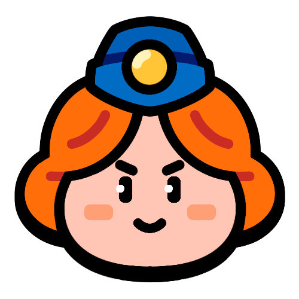

# 突击小队部队

在软启动中，将发布27个普通部队和2个超级部队，总共29个。

每个世界可解锁的部队数量如下:

## 绿色世界: 12个部队

    

        
    

    

        
    

    

        
    

    

        
    

    

        
    

    

        
    

    

        
    

    

        
    

    

        
    

    

        
    

    

        
    

    

        
    

## Desert World: 6 Troops

    

        
    

    

        
    

    

        
    

    

        
    

    

        
    

    

        
    

## Royal World: 6 Troops

    

        
    

    

        
    

    

        
    

    

        
    

    

        
    

    

        
    

## Beach World: 3 Troops

    

        
    

    

        
    

    

        
    

___

You can browse through all the troops in the following ways:

[**Troop Info Cards**](/sb/troops_cards)

[**Damage Per Second Ranking**](/sb/troops_by_dps)

[**Hit Points Ranking**](/sb/troops_by_hp)
