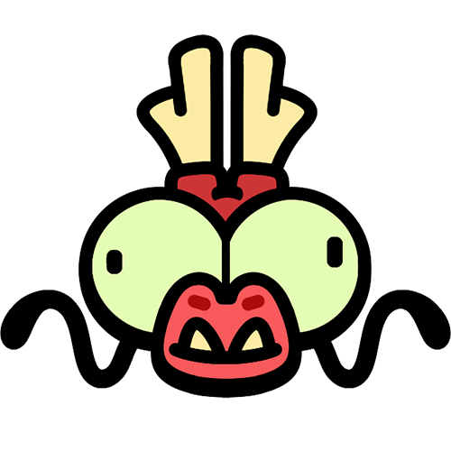
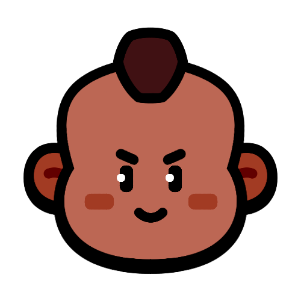
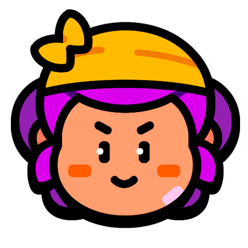
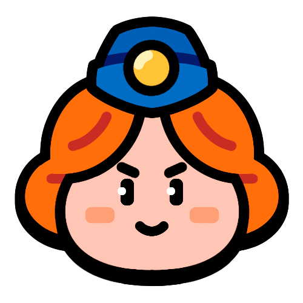

# 按秒伤排序

|   | 角色 | 血量 | 秒伤 | 
| -- | -- | -- | -- |
|  | 蛟龙母鸡 | 8000 | 273 |
|  | 虎王普里莫 | 11000 | 237 |
|  | 潘妮 | 1100 | 219 |
|  | 女巫 | 1000 | 212 |
|  | 柯尔特 | 750 | 190 |
|  | 贝亚 | 900 | 189 |
|  | 麦克斯 | 1100 | 188 |
|  | 母鸡 | 1000 | 182 |
|  | 莫提斯 | 1700 | 165 |
|  | 帕姆 | 1200 | 162 |
|  | 哥布林 | 1200 | 159 |
|  | 弓箭女皇 | 1200 | 154 |
|  | 野猪骑士 | 1500 | 142 |
|  | 雪莉 | 1300 | 141 |
|  | 野蛮人之王 | 3200 | 139 |
|  | 野蛮人 | 1400 | 132 |
|  | 阿渤 | 700 | 120 |
|  | 重机枪手 | 2300 | 120 |
|  | 医师 | 900 | 119 |
|  | 坦克驾驶员 | 1200 | 118 |
|  | 梅维斯 | 1300 | 115 |
|  | 法师 | 850 | 115 |
|  | 战斗天使 | 1800 | 113 |
|  | 国王 | 2200 | 110 |
|  | 普利莫 | 2800 | 95 |
|  | 格雷格 | 1300 | 94 |
|  | 商人 | 1600 | 94 |
|  | 妮塔 | 1200 | 82 |
|  | 爆破麦克 | 800 | 58 |

