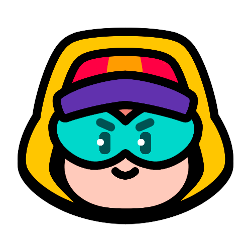
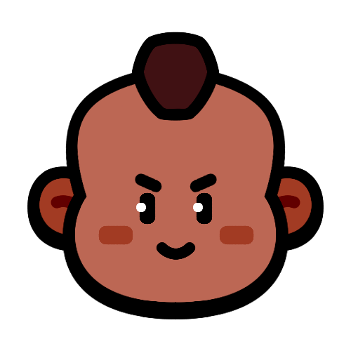

# 融合加成

当你将3个部队合并成一个融合部队时，你会得到一个比之前的部队更强大的部队，但不完全是3倍的强度。

通常，融合的属性加成如下：

- 3.50倍的生命值（+250%）
- 2.05倍的伤害（+105%）
治疗效果通常比伤害增加更多。

这是每个融合部队具体加成的完整列表：

|   | Troop | Fusion HP | Fusion DPS | 
| -- | -- | -- | -- |
|  | 女巫 | 3.50x | 2.10x |
|  | 麦克斯 | 3.50x | 2.10x |
|  | 莫提斯 | 3.50x | 2.10x |
|  | 弓箭女皇 | 3.50x | 2.10x |
|  | 野蛮人之王 | 3.50x | 2.10x |
|  | 坦克驾驶员 | 3.50x | 2.10x |
|  | 战斗天使 | 3.50x | 2.10x |
|  | 国王 | 3.50x | 2.10x |
|  | 潘妮 | 3.50x | 2.05x |
|  | 贝亚 | 3.50x | 2.05x |
|  | 帕姆 | 3.50x | 2.05x |
|  | 野猪骑士 | 3.50x | 2.05x |
|  | 医师 | 3.50x | 2.05x |
|  | 法师 | 3.50x | 2.05x |
|  | 妮塔 | 3.50x | 2.05x |
|  | 爆破麦克 | 3.50x | 2.05x |
|  | 柯尔特 | 3.50x | 2.00x |
|  | 母鸡 | 3.50x | 2.00x |
|  | 哥布林 | 3.50x | 2.00x |
|  | 雪莉 | 3.50x | 2.00x |
|  | 野蛮人 | 3.50x | 2.00x |
|  | 阿渤 | 3.50x | 2.00x |
|  | 重机枪手 | 3.50x | 2.00x |
|  | 梅维斯 | 3.50x | 2.00x |
|  | 普利莫 | 3.50x | 2.00x |
|  | 格雷格 | 3.50x | 2.00x |
|  | 商人 | 3.50x | 2.00x |

